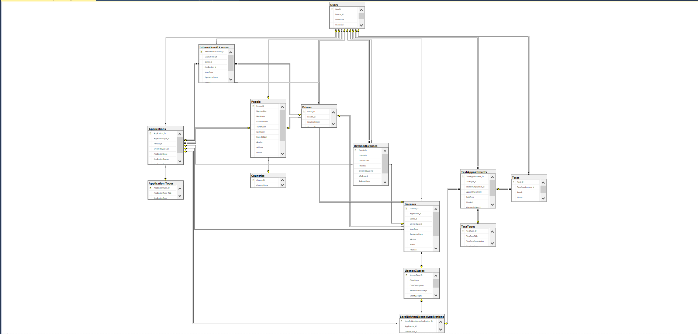

# 🗃️ Database Documentation - Driving License Management System

This folder contains the database documentation for the **Driving License Management System** project.

---

## 📂 Contents of this folder

- `Project_Database_BackUp` ➜ A full backup of the database - You can restore it via SQL Server Management Studio if needed.
- `CreateDatabaseScript.sql` ➜ Contains the SQL script to create tables and relationships.
- `Database_Diagram.png` ➜ Image illustrating the overall database structure (ER Diagram).
- `README.md` ➜ This file, providing an overview of the database design.

---

## 🧱 Main Tables

- `People`: Contains Pepole information
- `Applications`: Contains Applications information
- `Drivers`: Contains driver information
- `Licenses`: Driving license details
- `Tests`: Driving test records
- `Users`: User management and permissions (if applicable)

---

## 🖼️ Database Diagram

The following image shows the general structure of tables and relationships:

---

## 📜 Database Script

You can use the `CreateDatabaseScript.sql` file to recreate the database in SQL Server:

### How to use:

1. Open `SQL Server Management Studio (SSMS)`
2. Create a new database
3. Open `CreateDatabaseScript.sql` and paste it into a new query window
4. Execute the script (press `Execute`)

---

## ℹ️ Notes

- The database is designed to meet the needs of managing driving licenses and tests.
- It can be extended later to include reports or more advanced user permissions.
